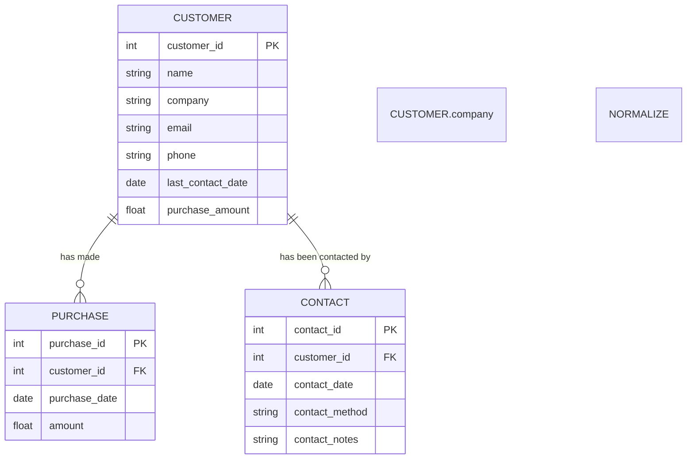

```markdown
# システム設計書: 架電レコメンドツール

## ER図（Mermaid コードブロック付き）

このER図では基幹システムCSV、支店Excel、名刺OCRテキストの3つのデータソースを統合し、一貫したデータスキーマを表示しています。データ品質リスク（NULL値、重複、表記揺れ）に対する対策も含んでいます。



## DDL（SQL コードブロック付き）

以下はデータ統合後のDDLです。全てのテーブルを作成するため、NULL可能性、インデックスも考慮しています。

```sql
CREATE TABLE CUSTOMER (
    customer_id INT PRIMARY KEY,
    name VARCHAR(255) NOT NULL,
    company VARCHAR(255),
    email VARCHAR(255),
    phone VARCHAR(20),
    last_contact_date DATE,
    purchase_amount FLOAT,
    CONSTRAINT UNIQUE (email)
);

CREATE TABLE PURCHASE (
    purchase_id INT PRIMARY KEY,
    customer_id INT NOT NULL,
    purchase_date DATE NOT NULL,
    amount FLOAT NOT NULL,
    FOREIGN KEY (customer_id) REFERENCES CUSTOMER(customer_id)
);

CREATE TABLE CONTACT (
    contact_id INT PRIMARY KEY,
    customer_id INT NOT NULL,
    contact_date DATE NOT NULL,
    contact_method VARCHAR(50),
    contact_notes TEXT,
    FOREIGN KEY (customer_id) REFERENCES CUSTOMER(customer_id)
);

CREATE INDEX idx_customer_name ON CUSTOMER(name);
CREATE INDEX idx_purchase_date ON PURCHASE(purchase_date);
CREATE INDEX idx_contact_date ON CONTACT(contact_date);
```

## AIスコアリングロジック設計

### スコアリングロジックの選定
- **ルールベースアプローチ**: 各顧客の架電優先順位を、前回の連絡日、購入金額、商談履歴を元にスコアリングする。
- **機械学習アプローチ**: 過去の架電履歴と成約率の傾向から顧客の成約期待値をモデリングし、スコアをつける。

### 初期段階の選定
- **ルールベースを選定 (プロトタイプ段階)**:
  - **理由**: 短期間での実装と調整が容易であり、現場の営業活動の理解が深まる。
  - **ルールベースのスコア計算例**:
    - スコア = (日数経過得点/最終コンタクト日から今日までの日数) + (重み*購入金額)

### 機械学習への移行計画
- ルールベースで効果検証後、データが蓄積された段階で機械学習モデルを実装し、較正を行う。

## DECISION LOG（技術選定比較表）

以下は各カテゴリでの技術比較表です。

| カテゴリ          | 技術選定候補               | 学習コスト | 運用コスト | 拡張性 | チームスキル適合性 | 選定理由                                                 |
|-------------------|----------------------------|------------|------------|--------|--------------------|----------------------------------------------------------|
| データベース      | PostgreSQL                 | 低         | 中         | 高     | 高                 | オープンソースで機能豊富。スキーマ設計の柔軟性が高い。  |
|                   | MySQL                      | 低         | 中         | 中     | 高                 | 複数環境でのサポートと大規模サポート。                   |
| バックエンドFW    | Node.js                    | 中         | 低         | 高     | 中                 | 非同期処理によるレスポンス向上。JSスタックで統一可能。  |
|                   | Django                     | 中         | 中         | 中     | 高                 | Pythonナレッジのあるチーム向け。多機能でフルスタック。  |
| AI/MLライブラリ   | scikit-learn               | 低         | 低         | 中     | 高                 | 簡易なプロトタイプに最適。豊富なサポートとドキュメント。|
|                   | TensorFlow                 | 高         | 中         | 高     | 中                 | 本格的な機械学習モデルに適したライブラリ。              |
| フロントエンド    | React                      | 中         | 高         | 高     | 高                 | コンポーネントベースの開発が可能。リッチUIを実現。       |
|                   | Vue.js                     | 中         | 中         | 高     | 中                 | 学習曲線が低く、モダンJS開発に適している。               |

以上により、PostgreSQL、Node.js、Reactおよびscikit-learnを選定しました。初期導入やプロトタイプに最適であり、性能面やチームスキル面での利点が大きいことが理由です。将来的なML機能強化に備え、TensorFlowへの移行も視野に入れます。
```
