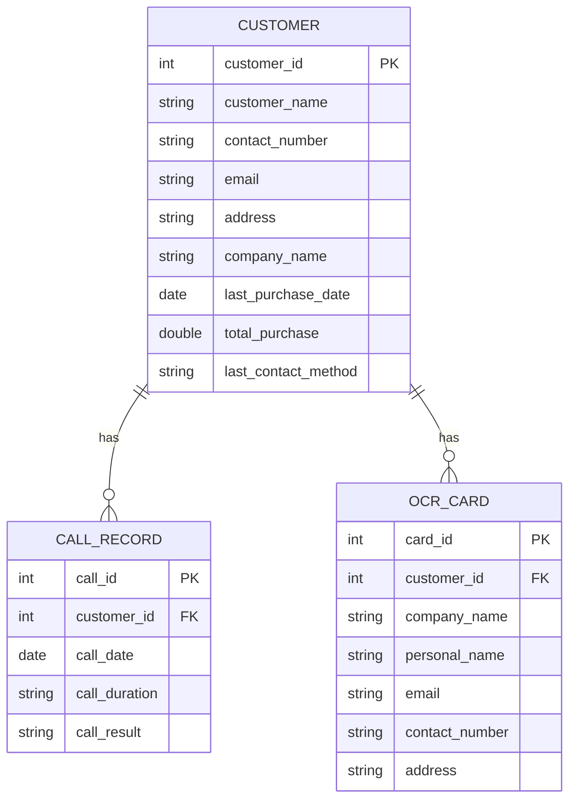

```markdown
# システム設計書: 架電レコメンドツール

## ER図（Mermaid コードブロック付き）



### 解説
- **NULL値の対処**：`last_purchase_date`や直接参照されない補足情報は補正データソース（支店Excel, 名刺OCR）から補完する戦略。
- **重複**：顧客の`company_name`を統一し、OCR時の曖昧さを吸収。
- **表記揺れ**：正規化と統一機能で回避。

## DDL（SQL コードブロック付き）

```sql
CREATE TABLE CUSTOMER (
    customer_id INT PRIMARY KEY,
    customer_name VARCHAR(255) NOT NULL,
    contact_number VARCHAR(20),
    email VARCHAR(255),
    address VARCHAR(255),
    company_name VARCHAR(255) NOT NULL,
    last_purchase_date DATE,
    total_purchase DOUBLE DEFAULT 0,
    last_contact_method VARCHAR(50)
);

CREATE INDEX idx_customer_company ON CUSTOMER(company_name);

CREATE TABLE CALL_RECORD (
    call_id INT PRIMARY KEY,
    customer_id INT,
    call_date DATE NOT NULL,
    call_duration VARCHAR(10),
    call_result VARCHAR(255),
    FOREIGN KEY (customer_id) REFERENCES CUSTOMER(customer_id)
);

CREATE INDEX idx_call_customer ON CALL_RECORD(customer_id);

CREATE TABLE OCR_CARD (
    card_id INT PRIMARY KEY,
    customer_id INT,
    company_name VARCHAR(255),
    personal_name VARCHAR(255),
    email VARCHAR(255),
    contact_number VARCHAR(20),
    address VARCHAR(255),
    FOREIGN KEY (customer_id) REFERENCES CUSTOMER(customer_id)
);

CREATE INDEX idx_ocr_company ON OCR_CARD(company_name);
```
### 解説
- インデックスを`company_name`に設けることで、重複削除や表記揺れ修正を効率化。

## AIスコアリングロジック設計

### ルールベース vs 機械学習の比較

| 比較項目      | ルールベース   | 機械学習                           |
|---------------|---------------|-----------------------------------|
| 学習コスト    | 低い          | 高い（データセット準備が必要）   |
| 運用コスト    | 低い          | 高い（モデル再学習が必要）       |
| 拡張性        | 低い          | 高い（新しい特徴量追加可能）     |
| 精度          | 中程度        | 高い（適切な特徴量選択の場合）   |

#### 選択：プロトタイプ段階ではルールベース

- **理由**：設定が容易でデータの観察を容易にすることで、潜在的な特徴量抽出が行いやすい。初期投資も最小化でき、早期のプロトタイピングに向いています。

### 優先スコア算出ロジック
1. **購入金額ベース**：総購入額に応じてスコアリング
2. **架電経過日数**：最後の架電話からの日数
3. **商談履歴**：最近の商談結果から確度の高い顧客をリストアップ

スコア計算式の具体例: 
`Score = (total_purchase / 1000) + (1 / days_since_last_call) * 100`

## DECISION LOG（技術選定比較表）

### データベース

| 技術選定  | MySQL            | PostgreSQL                                                         |
|-----------|------------------|-------------------------------------------------------------------|
| 学習コスト| 低い             | 中程度 (より多機能なため)                                        |
| 運用コスト| 低い             | 中程度 (拡張性に伴う管理の複雑さ)                                |
| 拡張性    | 中程度           | 高い (複雑なクエリ、ネイティブ機能が豊富)                          |
| チームスキル適合性 | 既存知識あり | 一部チームメンバーに知識あり                                   |

#### 選択：MySQL
- **理由**：チームの既存知識活用により、短期間でインパクトのあるプロトタイプ構築が可能。

### バックエンドFW

| 技術選定  | Flask               | Express.js                                |
|-----------|---------------------|------------------------------------------|
| 学習コスト | 低い                | 低い                                     |
| 運用コスト | 中程度              | 低い                                     |
| 拡張性     | 中程度              | 高い（非同期処理など）                    |
| チームスキル適合性 | アクセス容易 | よく使われている                          |

#### 選択：Flask
- **理由**：シンプルでモジュール化しやすいため、迅速な開発に貢献。

### AI/MLライブラリ

| 技術選定  | scikit-learn   | TensorFlow                                |
|-----------|----------------|-------------------------------------------|
| 学習コスト| 低い           | 高い (より高度な設定が必要)               |
| 運用コスト| 低い           | 中程度                                    |
| 拡張性    | 中程度         | 高い (ディープラーニング適用可能)         |
| チームスキル適合性 | なじみ深い    | 一部チームメンバーに経験あり              |

#### 選択：scikit-learn
- **理由**：プロトタイプ段階ではシンプルな実装で十分。設定の容易さとチーム経験を考慮。

### フロントエンド

| 技術選定   | React           | Vue.js                                    |
|------------|-----------------|------------------------------------------|
| 学習コスト | 中程度          | 低い                                     |
| 運用コスト | 中程度          | 低い                                     |
| 拡張性     | 高い            | 中程度                                    |
| チームスキル適合性 | 人気         | 一部メンバーに熟練                        |

#### 選択：Vue.js
- **理由**：初期の構築とスケーラビリティを考慮したプロトタイプでは適切。

この設計書は、要件に基づいて最適と考えられる技術選定と統合戦略を記述しました。各選定においてはプロジェクトの段階に応じた適合性を重視しています。
```
